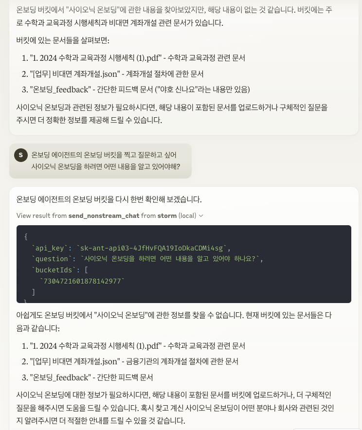
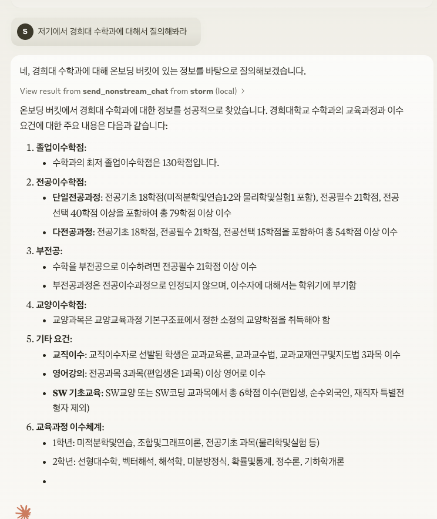
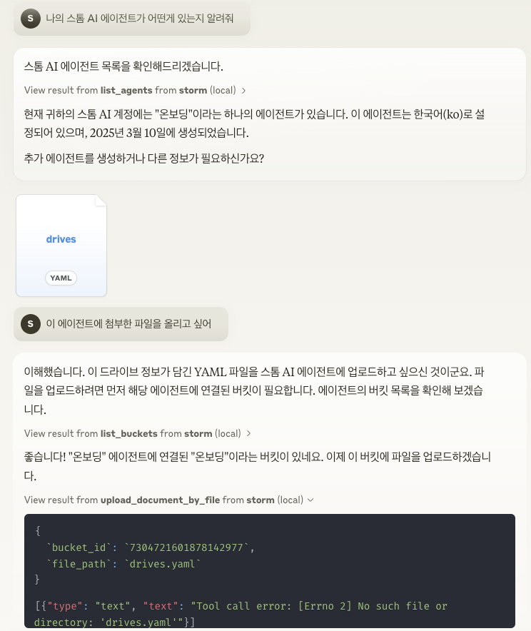
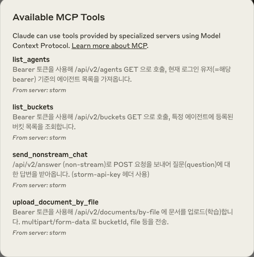

# Storm MCP Server with Sionic AI serverless RAG

## Korean (한국어)

### Storm MCP(Model Context Protocol) Server

Storm MCP(Model Context Protocol) 서버는 LLM 애플리케이션과 RAG 데이터 소스 및 도구들 간의 원활한 통합을 가능하게 하는 개방형 프로토콜입니다.
Anthropic의 [Model Context Protocol](https://modelcontextprotocol.io/introduction)을 구현하여 Claude Desktop에서 Storm Platform을 바로 이용합니다.

Sionic AI 의 [Storm Platform](https://sionicstorm.ai) 를 통합해서 사용하여 나만의 강력한 임베딩 모델과 벡터DB 제품군을 연결하여 사용할 수 있습니다.
https://sionicstorm.ai 에서 에이전트 단위로 가입하여서 API Token을 얻어서 RAG 솔루션을 바로 만드실 수 있습니다.

#### 사용 예시




API Key는 `scripts/run.sh` 에 존재하는 `export STORM_API_KEY=''` 에 입력하세요.

#### 주요 기능

- **컨텍스트 공유**: LLM과 데이터 소스 간의 상호작용을 위한 표준 프로토콜을 제공합니다.
- **도구 시스템**: 도구를 정의하고 호출하는 표준화된 방식을 제공합니다(send_nonstream_chat, list_agents, list_buckets, upload_document_by_file 등).
- **파일 관리**: 파일 업로드, 읽기 및 관리를 위한 파일 시스템 작업을 구현합니다.
- **API 통합**: Storm의 API 엔드포인트와 연결하여 다양한 기능을 제공합니다.

#### 프로젝트 구조

- **main.py**: MCP 서버를 초기화하고 이벤트 핸들러를 설정합니다.
- **core/file_manager.py**: 파일 작업을 위한 `FileSystemManager` 클래스를 구현합니다.
- **core/internal_api.py**: Storm의 REST API 엔드포인트와 상호 작용하기 위한 API 클라이언트 함수를 포함합니다.
- **tools/tool_definitions.py**: MCP 서버에서 사용 가능한 도구를 정의합니다.
- **tools/tool_handlers.py**: 도구 작업을 위한 핸들러를 구현합니다.
- **tools/tool_upload_file.py**: 자체 MCP 핸들러가 있는 파일 작업을 위한 별도의 파일 서버를 구현합니다.

#### 아키텍처

MCP는 호스트(LLM 애플리케이션), 클라이언트(프로토콜 구현체), 서버(기능 제공자) 간의 3계층 구조로 설계되었습니다. Storm MCP 서버는 이 중 서버 부분을 구현하여 리소스와 도구를 LLM에 제공합니다.

#### 시작하기
**Claude Desktop** 환경에서 MCP 서버를 연결하려면, 아래와 같은 설정을 적용해야 합니다.



1) 설정 파일 열기
```bash
code ~/Library/Application\ Support/Claude/claude_desktop_config.json
```

2) JSON 내부에 MCP 서버 설정 추가:
```json
{
  "mcpServers": {
    "storm": {
      "command": "sh",
      "args": [
        "/Users/sigridjineth/Desktop/work/storm-mcp-server/scripts/run.sh"
      ]
    }
  }
}
```

## Japanese (日本語)

### Storm MCP(Model Context Protocol) Server

Storm MCP(Model Context Protocol) サーバーは、LLMアプリケーションとRAGデータソースおよびツール間のシームレスな統合を可能にするオープンプロトコルです。
Anthropicの[Model Context Protocol](https://modelcontextprotocol.io/introduction)を実装し、Claude DesktopでStorm Platformを直接利用できます。

Sionic AI の [Storm Platform](https://sionicstorm.ai) を統合して使用することで、自分だけの強力な埋め込みモデルとベクターDB製品群を接続して利用できます。
https://sionicstorm.ai でエージェント単位で登録してAPIトークンを取得し、すぐにRAGソリューションを作成できます。

#### 使用例


APIキーは `scripts/run.sh` の `export STORM_API_KEY=''` に入力してください。

#### 主な機能

- **コンテキスト共有**: LLMとデータソース間の相互作用のための標準プロトコルを提供します。
- **ツールシステム**: ツールを定義し呼び出すための標準化された方法を提供します（send_nonstream_chat、list_agents、list_buckets、upload_document_by_fileなど）。
- **ファイル管理**: ファイルのアップロード、読み込み、管理のためのファイルシステム操作を実装します。
- **API統合**: StormのAPIエンドポイントと接続し、様々な機能を提供します。

#### プロジェクト構造

- **main.py**: MCPサーバーを初期化し、イベントハンドラーを設定します。
- **core/file_manager.py**: ファイル操作のための`FileSystemManager`クラスを実装します。
- **core/internal_api.py**: StormのRESTAPIエンドポイントと相互作用するためのAPIクライアント関数を含みます。
- **tools/tool_definitions.py**: MCPサーバーで利用可能なツールを定義します。
- **tools/tool_handlers.py**: ツール操作のためのハンドラーを実装します。
- **tools/tool_upload_file.py**: 独自のMCPハンドラーを持つファイル操作のための別個のファイルサーバーを実装します。

#### アーキテクチャ

MCPは、ホスト（LLMアプリケーション）、クライアント（プロトコル実装）、サーバー（機能提供者）間の3層構造で設計されています。Storm MCPサーバーはこのうちサーバー部分を実装し、リソースとツールをLLMに提供します。

### 始め方
**Claude Desktop** 環境でMCPサーバーを接続するには、以下の設定を適用する必要があります。


1) 設定ファイルを開く
```bash
code ~/Library/Application\ Support/Claude/claude_desktop_config.json
```

2) JSON内にMCPサーバー設定を追加:
```json
{
  "mcpServers": {
    "storm": {
      "command": "sh",
      "args": [
        "/Users/sigridjineth/Desktop/work/storm-mcp-server/scripts/run.sh"
      ]
    }
  }
}
```