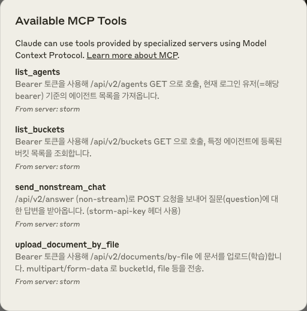

# Storm Platform MCP (Model Context Protocol)

## 1. MCP의 정의와 목적

### MCP란?
**Model Context Protocol(MCP)**은 LLM 애플리케이션과 외부 데이터/도구 간에 원활한 통합을 가능케 하는 **개방형 프로토콜**입니다.  
- AI 기반 IDE를 구축하든,  
- 채팅 인터페이스를 개선하든,  
- 커스텀 AI 워크플로우를 만들든,  

모두 LLM이 필요로 하는 **컨텍스트**와 연결하기 위한 **표준화된 방법**을 MCP가 제공합니다.

### MCP의 핵심 목적
1. **컨텍스트 공유 표준화**  
   - LLM과 데이터 소스가 상호작용하는 표준 프로토콜 제공  
   - 구조화된 방식으로 컨텍스트를 전달/관리  
   - 일관된 인터페이스를 통해 다양한 데이터에 접근  

2. **도구와 기능 노출**  
   - AI 시스템에 로컬/원격 도구를 **안전**하게 노출  
   - 표준화된 방식으로 도구의 **기능**을 정의하고 호출  
   - 도구의 능력(범위, 파라미터)을 명확히 기술하고 제어  

3. **통합 워크플로우 구축**  
   - 여러 데이터 소스와 도구를 조합한 워크플로우 생성  
   - 재사용 가능한 **프롬프트 템플릿** 제공  
   - 모듈식 구성을 통한 **유연한 확장**  

---

## 2. 주요 특징

### JSON-RPC 기반 통신
- **JSON-RPC 2.0** 메시지 포맷 사용  
- 상태 기반 연결 관리  
- 서버-클라이언트 간 **능력 협상**(capability negotiation)  

### 보안 중심 설계
- 사용자 동의와 제어를 최우선 고려  
- 데이터 프라이버시 보호  
- 도구 사용에 대한 명시적 승인 필요  

### 유연한 확장성
- 다양한 **리소스 타입** 지원  
- **커스텀 도구** 및 **프롬프트** 정의 가능  
- 표준화된 방식으로 기능을 확장  

---

## 3. 적용 분야

### 개발 도구
- AI 기반 코드 에디터/IDE 통합  
- 코드 분석/리뷰 자동화  
- 개발 워크플로우 자동화  

### 데이터 분석
- 로컬/원격 데이터베이스 연동  
- 데이터 시각화/분석용 도구 연결  
- 보안된 데이터 접근 및 처리  

### 대화형 인터페이스
- AI 챗봇, 어시스턴트, 질의응답 시스템  
- 지식 베이스 연동  
- 맞춤형 워크플로우 자동화  

---

## 4. 개발 철학

1. **개방성**  
   - 오픈 프로토콜로 제공  
   - 커뮤니티 주도 발전  
   - 표준화된 확장 방식  

2. **안전성**  
   - 사용자 중심의 보안 모델  
   - 명시적 권한 관리  
   - 데이터 보호 우선  

3. **실용성**  
   - 실제 사용 사례 중심 설계  
   - 구현 용이성 고려  
   - 효율적인 통신 구조  

---

## 5. 사용 예시: Claude에서 실행하기

**Claude Desktop** 환경에서 MCP 서버를 연결하려면, 아래와 같은 설정을 적용해야 합니다.



1) 설정 파일 열기
```bash
code ~/Library/Application\ Support/Claude/claude_desktop_config.json
```

2) JSON 내부에 MCP 서버 설정 추가:
```json
{
  "mcpServers": {
    "storm": {
      "command": "sh",
      "args": [
        "/Users/sigridjineth/Desktop/work/storm-mcp-server/scripts/run.sh"
      ]
    }
  }
}
```
